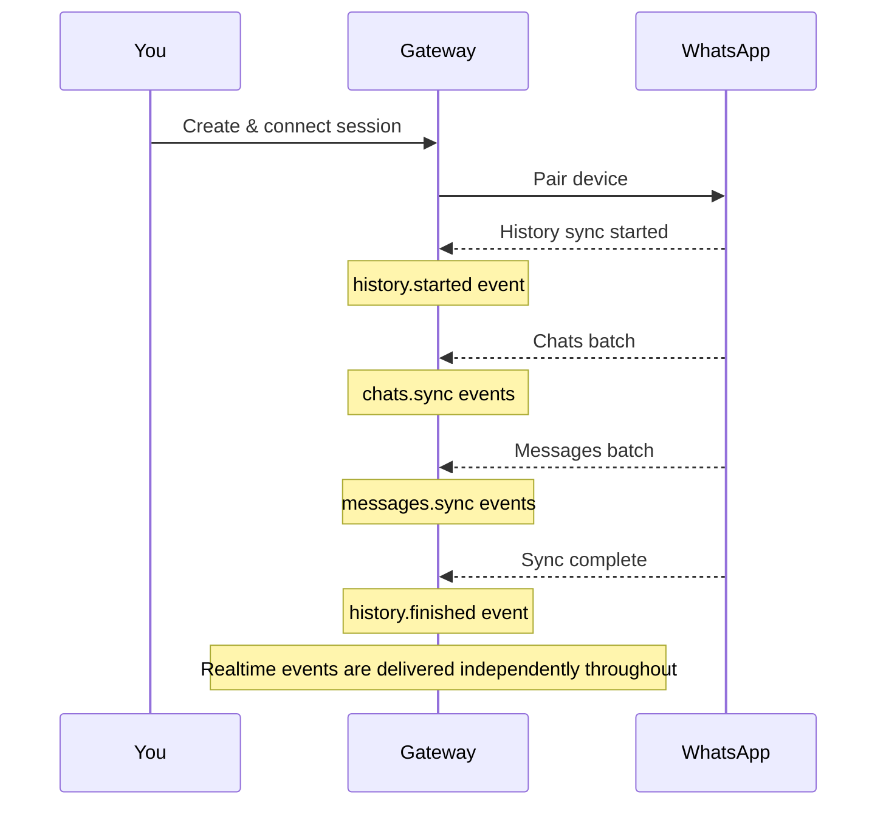

## Manual Contact History Sync

Manually sync message history for a specific contact:

```bash
POST /session/{id}/contact/{jid}/history
```

**Parameters:**

| Parameter | Type | Description |
|-----------|------|-------------|
| `id` | string | Session ID |
| `jid` | string | Contact JID or phone number (e.g., `6281234567890`) |

**Response:**

```json
{
  "success": true,
  "data": {
    "syncId": "uuid-here",
    "status": "pending"
  }
}
```

Returns HTTP 202 (Accepted). Use `syncId` to track progress via webhook events.

**Events:**

The sync triggers `messages.sync` events for each message batch. Listen for these on your webhook endpoint.

**Example:**

```bash
curl -X POST http://localhost:3000/session/my-session/contact/6281234567890/history \
  -H "X-API-Key: your-api-key"
```

## Overview

When you pair a new device, WhatsApp automatically syncs your existing chats and messages. This is called **History Sync**.

Contacts are resolved lazily when messages arrive — no bulk contact synchronization occurs during history sync.

## How It Works



## Sync Events

### history.started

Fired when history sync begins:

```json
{
  "event": "history.started",
  "historySync": true,
  "payload": {
    "historySessionId": "uuid-here"
  }
}
```

### chats.sync

Chat batches during sync:

```json
{
  "event": "chats.sync",
  "historySync": true,
  "payload": {
    "chats": [
      {
        "jid": "6281234567890@s.whatsapp.net",
        "name": "John Doe",
        "unreadCount": 5,
        "lastMessageTime": 1719000000000
      }
    ]
  }
}
```

### messages.sync

Message batches during sync:

```json
{
  "event": "messages.sync",
  "historySync": true,
  "payload": {
    "messages": [
      {
        "key": {
          "remoteJid": "6281234567890@s.whatsapp.net",
          "id": "3EB0C4A2B1F4E6D8",
          "fromMe": false
        },
        "message": {
          "conversation": "Hello!"
        },
        "messageTimestamp": 1719000000000
      }
    ]
  }
}
```

### history.finished

Fired when sync completes:

```json
{
  "event": "history.finished",
  "historySync": true,
  "payload": {
    "historySessionId": "uuid-here"
  }
}
```

## Batch Sizes

History sync delivers data in batches:

| Type | Default Batch Size | Config |
|------|-------------------|--------|
| Messages | 250 | `WEBHOOK_BATCH_MESSAGES` |
| Chats | 200 | `WEBHOOK_BATCH_CHATS` |

Configure in `.env`:

```bash
WEBHOOK_BATCH_MESSAGES=250
WEBHOOK_BATCH_CHATS=200
```

## Correlation

All events from a single history sync session share the same `historySessionId`:

```json
{
  "eventId": "...",
  "historySessionId": "abc-123-def",
  "historySync": true,
  "event": "messages.sync"
}
```

Use `historySessionId` to correlate events from the same sync session.
Use `historySync` to distinguish history data from realtime data.

## Handling Sync Events

### Independent Pipelines

History sync and realtime events are delivered through **independent pipelines**. They never block each other.

- **History events** (`historySync: true`) — delivered as background batches
- **Realtime events** (`historySync: false`) — delivered immediately, never delayed

You can process both simultaneously. Use the `historySync` flag to route events appropriately.

### Processing Strategy

```javascript
function handleWebhook(event) {
  if (event.historySync) {
    // History event — batch insert
    handleHistoryEvent(event);
  } else {
    // Realtime event — process immediately
    handleRealtimeEvent(event);
  }
}
```

## Ordering

History and realtime events use **independent sequence counters**. There is no ordering guarantee between the two pipelines.

- **Within history**: events are ordered by sequence (1, 2, 3, ...)
- **Within realtime**: events are ordered by sequence (1, 2, 3, ...)
- **Between pipelines**: no ordering relationship

Use `historySync` and `sequence` together for ordering:

```javascript
const lastSequence = {
  history: new Map(),
  realtime: new Map(),
};

function isOutOfOrder(event) {
  const pipeline = event.historySync ? 'history' : 'realtime';
  const last = lastSequence[pipeline].get(event.instanceId) || 0;
  return event.sequence <= last;
}
```

## Common Patterns

### Full Sync on First Connect

```javascript
async function handleFirstConnect(instanceId) {
  console.log(`Starting history sync for ${instanceId}`);
  
  // Wait for history.finished
  await waitForEvent('history.finished', instanceId);
  
  console.log(`Sync complete for ${instanceId}`);
}
```

Note: Realtime events are delivered immediately, even during history sync. You do not need to wait for `history.finished` to process realtime events.

### Incremental Updates

After initial sync, only realtime events arrive:

```javascript
function handleRealtimeMessage(event) {
  const { key, message } = event.payload;
  
  // New message received
  if (key.fromMe) {
    // Sent by us
  } else {
    // Received from someone
  }
}
```

## Troubleshooting

### Sync Not Starting

- Ensure session is properly paired
- Check WhatsApp app is connected
- Verify webhook is configured

### Missing Messages

- History sync only includes recent messages
- Very old messages may not be synced
- Check batch size configuration

### Out of Order Events

- Use `sequence` numbers to reorder
- Buffer events if needed
- Check for network issues

---

> [!info]
> History sync is a one-time process per device pairing. Once complete, only realtime events are delivered. Realtime events are **never delayed** by history sync — both pipelines run independently.

View full API reference for [Webhook events](/reference#tag/Webhook).
