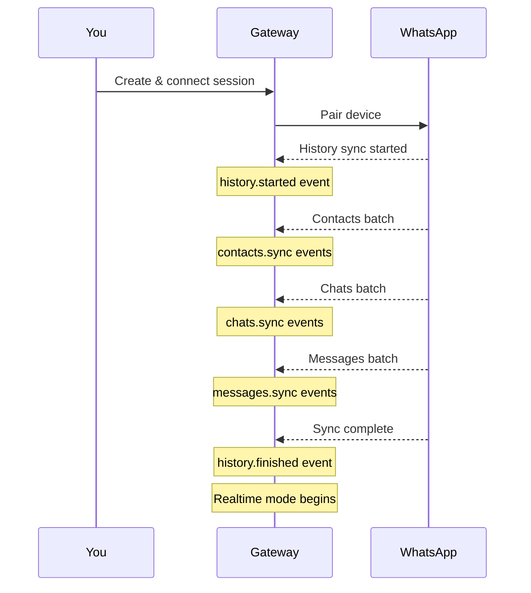

## Overview

When you pair a new device, WhatsApp automatically syncs your existing contacts, chats, and messages. This is called **History Sync**.

## How It Works



## Sync Events

### history.started

Fired when history sync begins:

```json
{
  "event": "history.started",
  "payload": {
    "historySessionId": "uuid-here"
  }
}
```

### contacts.sync

Contact batches during sync:

```json
{
  "event": "contacts.sync",
  "payload": {
    "contacts": [
      {
        "jid": "6281234567890@s.whatsapp.net",
        "name": "John Doe",
        "pushName": "John"
      }
    ]
  }
}
```

### chats.sync

Chat batches during sync:

```json
{
  "event": "chats.sync",
  "payload": {
    "chats": [
      {
        "jid": "6281234567890@s.whatsapp.net",
        "name": "John Doe",
        "unreadCount": 5,
        "lastMessageTime": 1719000000000
      }
    ]
  }
}
```

### messages.sync

Message batches during sync:

```json
{
  "event": "messages.sync",
  "payload": {
    "messages": [
      {
        "key": {
          "remoteJid": "6281234567890@s.whatsapp.net",
          "id": "3EB0C4A2B1F4E6D8",
          "fromMe": false
        },
        "message": {
          "conversation": "Hello!"
        },
        "messageTimestamp": 1719000000000
      }
    ]
  }
}
```

### history.finished

Fired when sync completes:

```json
{
  "event": "history.finished",
  "payload": {
    "historySessionId": "uuid-here"
  }
}
```

## Batch Sizes

History sync delivers data in batches:

| Type | Default Batch Size | Config |
|------|-------------------|--------|
| Messages | 250 | `WEBHOOK_BATCH_MESSAGES` |
| Contacts | 500 | `WEBHOOK_BATCH_CONTACTS` |
| Chats | 200 | `WEBHOOK_BATCH_CHATS` |

Configure in `.env`:

```bash
WEBHOOK_BATCH_MESSAGES=250
WEBHOOK_BATCH_CONTACTS=500
WEBHOOK_BATCH_CHATS=200
```

## Correlation

All events from a single history sync session share the same `historySessionId`:

```json
{
  "eventId": "...",
  "historySessionId": "abc-123-def",
  "event": "messages.sync"
}
```

Use this to correlate events from the same sync session.

## Handling Sync Events

### Buffering Strategy

Since sync events arrive in batches, consider buffering:

```javascript
class HistorySyncBuffer {
  constructor() {
    this.contacts = [];
    this.chats = [];
    this.messages = [];
  }

  addEvent(event) {
    switch (event.event) {
      case 'contacts.sync':
        this.contacts.push(...event.payload.contacts);
        break;
      case 'chats.sync':
        this.chats.push(...event.payload.chats);
        break;
      case 'messages.sync':
        this.messages.push(...event.payload.messages);
        break;
    }
  }

  async flush() {
    // Save to database
    await db.contacts.bulkInsert(this.contacts);
    await db.chats.bulkInsert(this.chats);
    await db.messages.bulkInsert(this.messages);
    
    // Clear buffer
    this.contacts = [];
    this.chats = [];
    this.messages = [];
  }
}
```

### Transition to Realtime

After `history.finished`, switch to realtime mode:

```javascript
const syncBuffer = new HistorySyncBuffer();
let isSyncing = false;

function handleWebhook(event) {
  if (event.event === 'history.started') {
    isSyncing = true;
    return;
  }

  if (event.event === 'history.finished') {
    isSyncing = false;
    syncBuffer.flush();
    return;
  }

  if (isSyncing) {
    // Buffer during sync
    syncBuffer.addEvent(event);
  } else {
    // Process realtime events immediately
    processRealtimeEvent(event);
  }
}
```

## Ordering

Events are delivered in order within each sync session. However, different sync sessions may interleave.

Use `sequence` numbers for ordering verification:

```javascript
const lastSequence = new Map();

function isOutOfOrder(event) {
  const last = lastSequence.get(event.instanceId) || 0;
  return event.sequence <= last;
}
```

## Common Patterns

### Full Sync on First Connect

```javascript
async function handleFirstConnect(instanceId) {
  console.log(`Starting history sync for ${instanceId}`);
  
  // Wait for history.finished
  await waitForEvent('history.finished', instanceId);
  
  console.log(`Sync complete for ${instanceId}`);
  // Now ready for realtime events
}
```

### Incremental Updates

After initial sync, only realtime events arrive:

```javascript
function handleRealtimeMessage(event) {
  const { key, message } = event.payload;
  
  // New message received
  if (key.fromMe) {
    // Sent by us
  } else {
    // Received from someone
  }
}
```

## Troubleshooting

### Sync Not Starting

- Ensure session is properly paired
- Check WhatsApp app is connected
- Verify webhook is configured

### Missing Messages

- History sync only includes recent messages
- Very old messages may not be synced
- Check batch size configuration

### Out of Order Events

- Use `sequence` numbers to reorder
- Buffer events if needed
- Check for network issues

---

> [!info]
> History sync is a one-time process per device pairing. Once complete, only new events are delivered.

View full API reference for [Webhook events](/reference#tag/Webhook).
