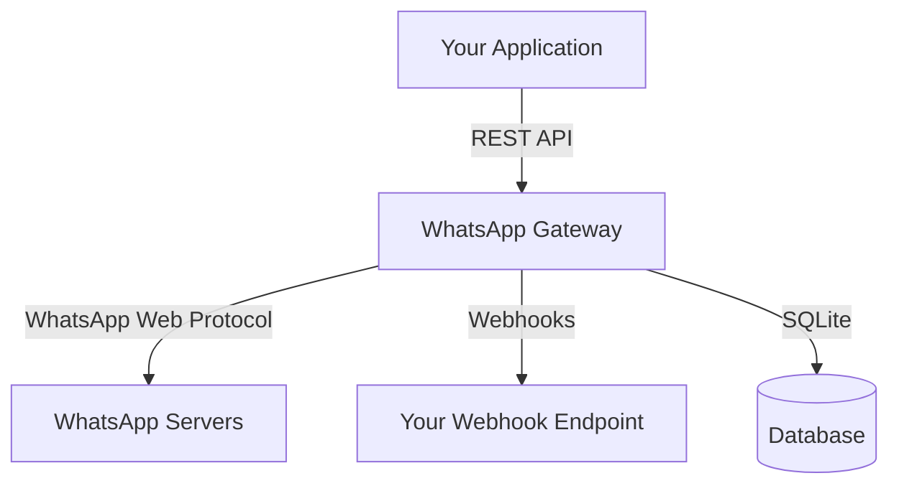

## What is WhatsApp Gateway?

WhatsApp Gateway is a REST API gateway for WhatsApp Web, powered by [Baileys](https://github.com/WhiskeySockets/Baileys) and [Hono](https://hono.dev). It provides a simple, reliable way to integrate WhatsApp messaging into your applications.

## Core Features

- **Session Management** - Create and manage multiple WhatsApp sessions with QR code or phone number pairing
- **Rich Messaging** - Send text, images, videos, documents, locations, contacts, polls, and more
- **Webhook Events** - Receive real-time events for messages, contacts, groups, and connection status
- **History Sync** - Automatic synchronization of contacts, chats, and messages when pairing a device
- **Dead Letter Queue** - Failed webhook deliveries are automatically retried and can be inspected

## Architecture



## Why Use WhatsApp Gateway?

### Simple

A single REST API to send and receive WhatsApp messages. No need to deal with the WhatsApp Web protocol directly.

### Reliable

Built-in retry mechanisms, dead letter queue, and persistent message storage ensure your messages are delivered.

### Developer Friendly

Comprehensive API documentation, OpenAPI spec, and SDK support. Get started in minutes.

## Quick Example

Send a text message:

```bash
curl -X POST http://localhost:3000/session/my-session/send \
  -H "Content-Type: application/json" \
  -H "X-API-Key: your-api-key" \
  -d '{
    "type": "text",
    "to": "6281234567890@s.whatsapp.net",
    "text": "Hello from WhatsApp Gateway!"
  }'
```

## Next Steps

- [Getting Started](/docs/getting-started) - Set up your first session in 5 minutes
- [Installation](/docs/installation) - Install via npm or Docker
- [API Reference](/reference) - Explore the full API

---

> [!info]
> This documentation covers the WhatsApp Gateway v3.0 with History Sync support. For older versions, see the [changelog](/docs/changelog).
