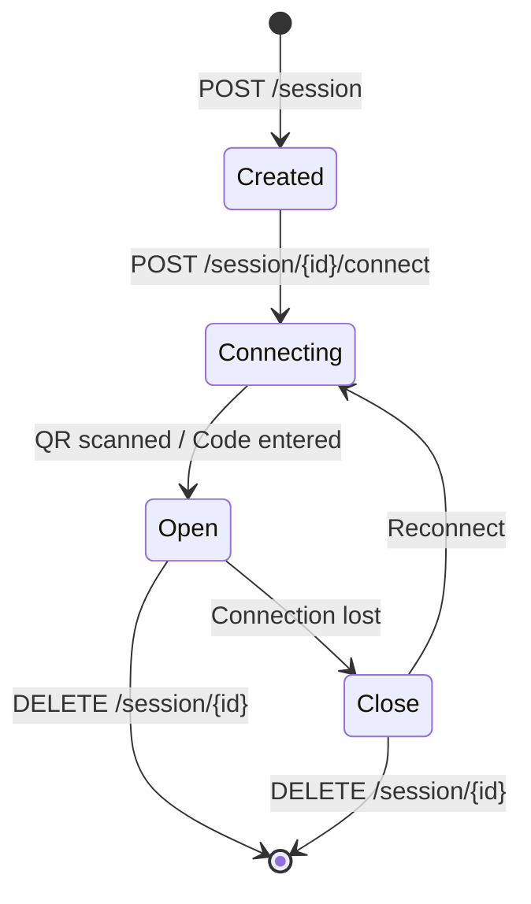
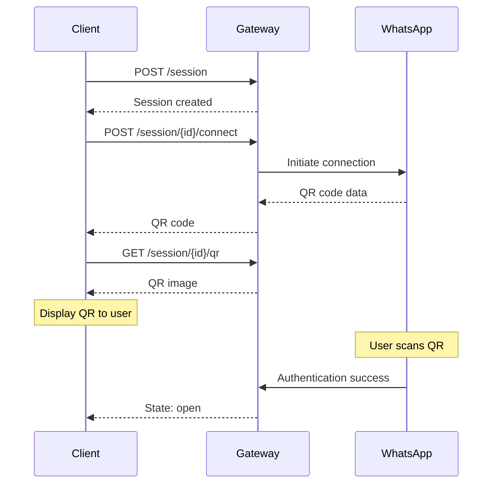

## Overview

A session represents a connection to a WhatsApp account. Each session has its own authentication state and message history.

## Session Lifecycle



## Create a Session

```bash
curl -X POST http://localhost:3000/session \
  -H "Content-Type: application/json" \
  -H "X-API-Key: your-api-key" \
  -d '{"id": "my-session"}'
```

**Request Body:**

| Field | Type | Required | Description |
|-------|------|----------|-------------|
| `id` | string | No | Custom session ID (auto-generated if omitted) |

**Response:**

```json
{
  "success": true,
  "data": {
    "id": "my-session",
    "state": "connecting"
  }
}
```

## List Sessions

```bash
curl http://localhost:3000/session \
  -H "X-API-Key: your-api-key"
```

**Response:**

```json
{
  "success": true,
  "data": [
    {
      "id": "my-session",
      "state": "open",
      "pushName": "John Doe"
    }
  ]
}
```

## Connect a Session

Initiates the QR code or pairing code flow:

```bash
curl -X POST http://localhost:3000/session/my-session/connect \
  -H "X-API-Key: your-api-key"
```

**Response:**

```json
{
  "success": true,
  "data": {
    "id": "my-session",
    "state": "connecting",
    "qr": "2@abc123..."
  }
}
```

## Get QR Code

Retrieve the QR code as an image:

```bash
# PNG image (default)
curl http://localhost:3000/session/my-session/qr \
  -H "X-API-Key: your-api-key" \
  -o qr.png

# Base64 JSON
curl "http://localhost:3000/session/my-session/qr?format=base64" \
  -H "X-API-Key: your-api-key"
```

**Parameters:**

| Parameter | Type | Default | Description |
|-----------|------|---------|-------------|
| `format` | string | `png` | Response format: `png` or `base64` |

## Get Session Status

```bash
curl http://localhost:3000/session/my-session/status \
  -H "X-API-Key: your-api-key"
```

**Response:**

```json
{
  "success": true,
  "data": {
    "id": "my-session",
    "state": "open",
    "pushName": "John Doe"
  }
}
```

**Session States:**

| State | Description |
|-------|-------------|
| `connecting` | Waiting for QR scan or code entry |
| `open` | Connected and ready |
| `close` | Disconnected |

## Delete a Session

Destroys the session and removes all authentication data:

```bash
curl -X DELETE http://localhost:3000/session/my-session \
  -H "X-API-Key: your-api-key"
```

**Response:**

```json
{
  "success": true,
  "data": {
    "deleted": true
  }
}
```

## QR Code Pairing

### Flow Diagram



## Pairing Code

For devices that don't support QR scanning:

```bash
curl -X POST http://localhost:3000/session/my-session/connect \
  -H "X-API-Key: your-api-key"
```

The response will include an 8-digit pairing code that the user enters on their phone.

## Reconnection

Sessions automatically attempt to reconnect when the connection is lost. You can also manually reconnect:

```bash
curl -X POST http://localhost:3000/session/my-session/connect \
  -H "X-API-Key: your-api-key"
```

## Session Storage

Sessions are stored in the `SESSIONS_DIR` directory (default: `./sessions`). Each session has its own subdirectory containing:

- Authentication credentials
- Encryption keys
- Session metadata

> [!warning]
> Back up the sessions directory to preserve authentication. Deleting it requires re-pairing.

## Error Handling

### Session Not Found

```json
{
  "success": false,
  "error": {
    "code": "NOT_FOUND",
    "message": "Session not found"
  }
}
```

### Session Already Exists

```json
{
  "success": false,
  "error": {
    "code": "CONFLICT",
    "message": "Session already exists"
  }
}
```

---

> [!tip]
> Use descriptive session IDs like `production-bot` or `support-agent-1` to organize multiple sessions.

View full API reference for [Session endpoints](/reference#tag/Session).
